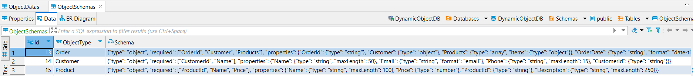
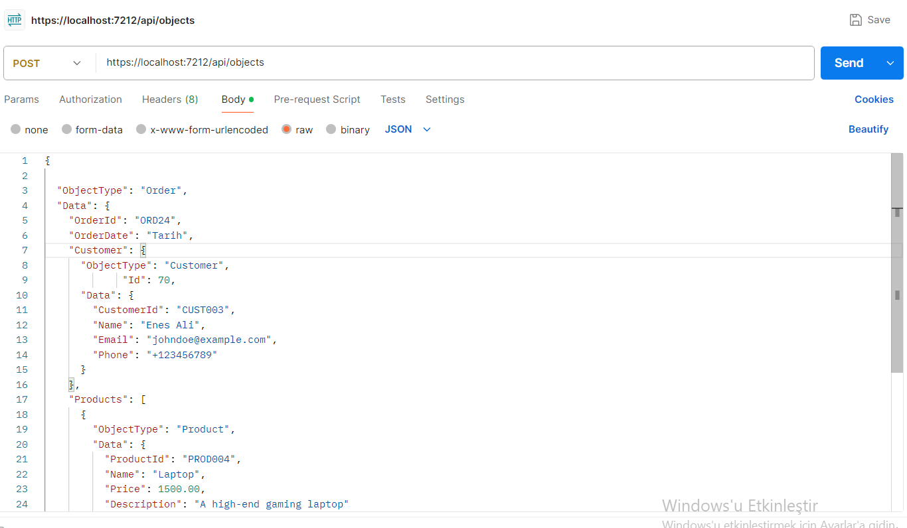
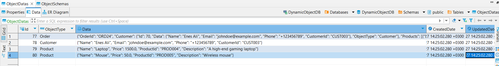
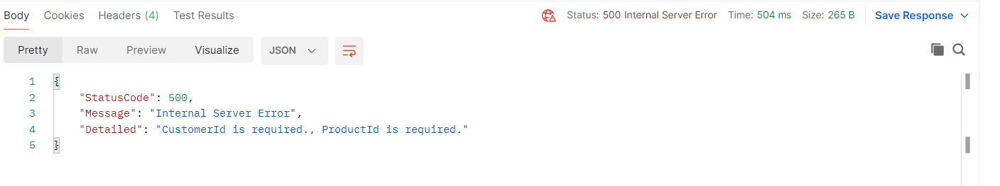
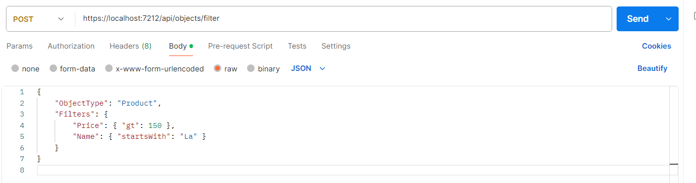
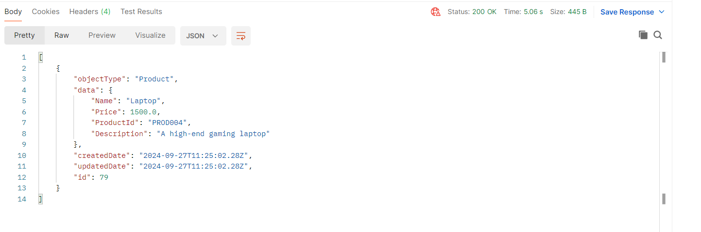
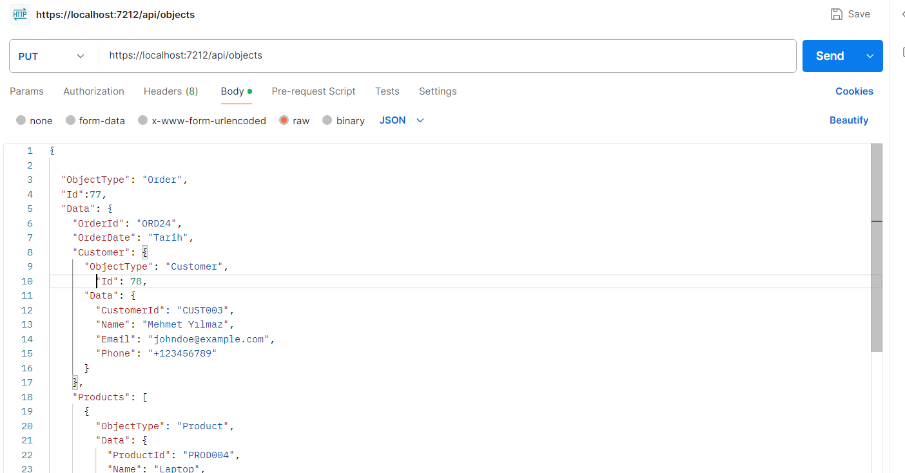
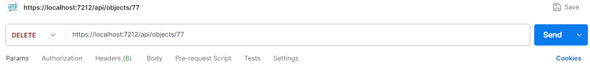
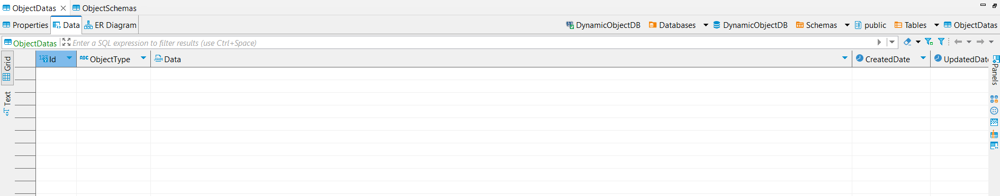
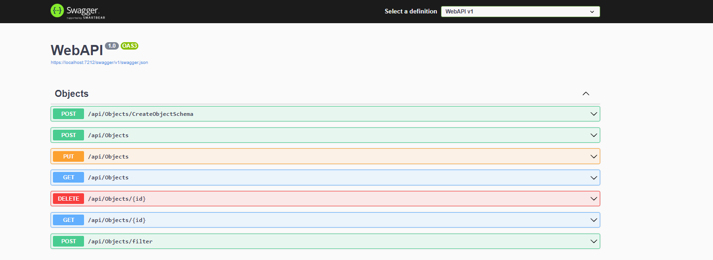

# Dynamic Object Management System

-   This project is a \*\*Dynamic Object Management System\*\* built
    using \*\*ASP.NET Core\*\*. It allows users to dynamically create
    objects with custom schemas, manage relationships between objects,
    and perform CRUD operations (Create, Read, Update, Delete) on them.
    The system supports dynamic object filtering based on custom fields
    and values.

## \## Technologies

-   ASP.NET Core 8.0

-   Entity Framework Core Code First

-   PostgreSQL

-   n-Layer Architecture

-   Newtonsoft.Json (JSON Serialization)

-   Exception Handling Middleware

-   Generic Repository Design Pattern

-   Async Programming

-   Dependency Injection

-   Transaction with Autofac (Interceptor)

## **\## Process of Project**

### **1.Adding Schemas For Objects That Wanted To Add**

-   Users must first create the type and fields of the object they want
    to add. The object type is sent as string and the fields are sent as
    JSON. The fields required for validation must also be sent in
    JSON.("required":)

 Image 1 : CreateObjectSchema request

-   The schema sent with the request is stored in the ObjectSchema
    table.

 Image 2 : Example ObjectSchema Table

### 

### **2.Adding Datas According to ObjectSchema**

-   The data to be added is sent as a string in ObjectType and as JSON
    in data.

 Image 4 : Example AddObjectData request

-   The master-object and sub-objects in the incoming request are
    validated. If no problems occur, they are added to the database.

 Image 5 : Display of Database after adding data

-   If there is a problem with the validation of the master-object and
    sub-object, the Global Exception Handler throws an error.

 Image 6 : Exception result of validation errors

## 

## **3.Get Filtered Datas**

-   For filtering, conditions are sent as ObjectType and JSON as
    strings. Filters are sent as "lt": (less than) for greater than,
    "gt": (greater than) for less than, and "startsWith": x starts with
    a letter.

 Image 7 : Example of filter request

 Image 8 : Result of filter request

## **4.Updating Datas**

-   The data to be updated is sent as an object, just like in the
    addition process, and the data to be updated is updated by
    performing master-object and sub-object validations.

 Image 9 : Example Update Request

## **5. Deleting Data**

-   The data to be deleted is deleted by giving its id via the route. At
    the same time, the sub-object data within the data is also deleted.

 Image 10 : Example Delete Request

 Image 11 : Database after Deleting
Master-Object and Its Sub-Objects

